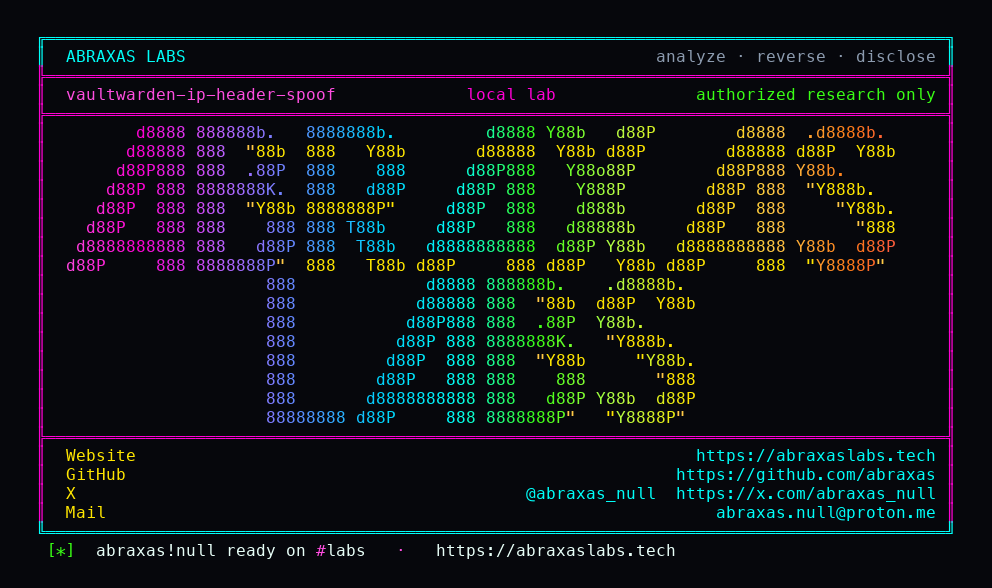

<p align="center">
  
</p>

<p align="center">
  <a href="https://abraxaslabs.tech"><strong>abraxaslabs.tech</strong></a>
  &nbsp;·&nbsp;
  <a href="https://github.com/abraxas">github.com/abraxas</a>
  &nbsp;·&nbsp;
  <a href="https://x.com/abraxas_null">@abraxas_null</a>
  &nbsp;·&nbsp;
  <a href="mailto:abraxas.null@proton.me">abraxas.null@proton.me</a>
  &nbsp;·&nbsp;
  <a href="https://github.com/abraxas/vaultwarden-ip-header-spoof">vaultwarden-ip-header-spoof</a>
</p>

# vaultwarden-ip-header-spoof

**Vaultwarden** `1.37.3` - dani-garcia

Default `IP_HEADER=X-Real-IP` plus `IP_HEADER_TRUSTED_PROXIES=local` treats any non-global TCP peer as a reverse proxy. Stock Docker published-port NAT is RFC1918. A client-supplied `X-Real-IP` becomes the rate-limit key. Unique values never share a burst.

| | |
|---|---|
| ID | no CVE yet |
| CWE | [CWE-307](https://cwe.mitre.org/data/definitions/307.html) / [CWE-290](https://cwe.mitre.org/data/definitions/290.html) |
| CVSS | **High: 7.5** `CVSS:3.1/AV:N/AC:L/PR:N/UI:N/S:U/C:H/I:N/A:N` |
| Product | [Vaultwarden](https://github.com/dani-garcia/vaultwarden) |
| Affected | **1.37.3** (`eb212e23`). Image `vaultwarden/server:1.37.3`. Docker published-port / userland-proxy / Desktop NAT, or any RFC1918 peer. |
| Auth | unauthenticated |
| License | [GNU Affero GPL v3.0](LICENSE) |
| Lab | `127.0.0.1` only |

## What an attacker can do

The attacker **removes IP-keyed brute-force protection**. They send a fresh `X-Real-IP` on every try. The governor is a `DashMap` keyed on that address, so burst and period never trip.

- **Guess master passwords without a 429.** `POST /identity/connect/token` password-grant. Default burst is 10 per 60 seconds per IP. Unique headers reset the bucket.
- **Burn email-2FA and admin-token governors the same way.** `/api/two-factor/send-email-login`, `POST /admin`, plus unauth hint / prelogin / delete-recover / auth-request / Send access all key on `ClientIp`.
- **Reach the container through the published port.** Stock `docker run -p 80:80` and compose `80:80` make the peer a bridge or Desktop NAT address. `trusted=local` is `!is_global(peer)`. That matches.
- **2FA after a correct master password still runs.** This is unlimited guesses, not a second-factor skip.

A reverse proxy that **replaces** `X-Real-IP` with the real client, and a host bind whose peer is a global address, both keep the governor honest. The hole is the default plus a published port with no overwrite.

## How I found it

I pinned [dani-garcia/vaultwarden](https://github.com/dani-garcia/vaultwarden) **1.37.3** (`eb212e23`) after the 1.35.x / 1.36.0 / 1.37.0 GHSAs. [GHSA-c5rv](https://github.com/dani-garcia/vaultwarden/security/advisories/GHSA-c5rv-q295-7w4g) put `send-email-login` on `LIMITER_LOGIN`. The leftover is how `ClientIp` is chosen.

[`config.rs`](https://github.com/dani-garcia/vaultwarden/blob/1.37.3/src/config.rs) defaults `ip_header` to `X-Real-IP` and `ip_header_trusted_proxies` to `local`. [`auth.rs`](https://github.com/dani-garcia/vaultwarden/blob/1.37.3/src/auth.rs) `ip_header_is_trusted` treats `local` as `!is_global(remote)`. [`ratelimit.rs`](https://github.com/dani-garcia/vaultwarden/blob/1.37.3/src/ratelimit.rs) keys `LIMITER_LOGIN` on that `IpAddr`. Docker bridge, Desktop VM NAT, and loopback are all non-global.

I stood up stock `vaultwarden/server:1.37.3` on loopback `127.0.0.1:18170:80` with no overwrite-proxy, plus a second instance on `18171` with `IP_HEADER=none`. Registered `user@lab.invalid`. Password-grant with a wrong password and **no** header 429'd at request 11 (burst 10). The same grant with `X-Real-IP: 198.51.100.{n}` unique per try stayed HTTP 400 fourteen times, zero 429s. On the `none` instance, unique `203.0.113.{n}` still 429'd at 11.

```text
SUCCESS VAULTWARDEN-IP-HEADER-SPOOF nohdr-429-at=11 spoof-400=14 spoof-429=0 none-429-at=11 VAULTWARDEN-IP-HEADER-SPOOF-WITNESS
```

Wrong turns already recorded: the `1.37.3` image was not local, so the first compose waited on a pull; first `/alive` was an empty reply while Rocket bound, then 200 on wait 2; dummy register JSON (`masterPasswordHash` + a short `key`) was enough, no long-key retry. A reverse shell. Theatre. The oracle is 429 without the header and 400 with a unique one.

## Lab

```bash
cd lab
./run.sh
```

Target **only** `http://127.0.0.1:18170` (default) and `http://127.0.0.1:18171` (`IP_HEADER=none`). Image `vaultwarden/server:1.37.3`.

## The fix

Default `IP_HEADER` to `none`, or default `IP_HEADER_TRUSTED_PROXIES` to an empty list / explicit proxy CIDR. `local` as "any RFC1918 peer" is the published-port case. Existence of a forwarding header is not proof of a proxy.

## References

- [github.com/dani-garcia/vaultwarden](https://github.com/dani-garcia/vaultwarden) tag [1.37.3](https://github.com/dani-garcia/vaultwarden/releases/tag/1.37.3)
- [`src/config.rs`](https://github.com/dani-garcia/vaultwarden/blob/1.37.3/src/config.rs) (`ip_header`, `ip_header_trusted_proxies`)
- [`src/auth.rs`](https://github.com/dani-garcia/vaultwarden/blob/1.37.3/src/auth.rs) (`ip_header_is_trusted`, `ClientIp`)
- [`src/ratelimit.rs`](https://github.com/dani-garcia/vaultwarden/blob/1.37.3/src/ratelimit.rs)
- [CWE-307](https://cwe.mitre.org/data/definitions/307.html)

## License

[GNU Affero GPL v3.0](LICENSE)
